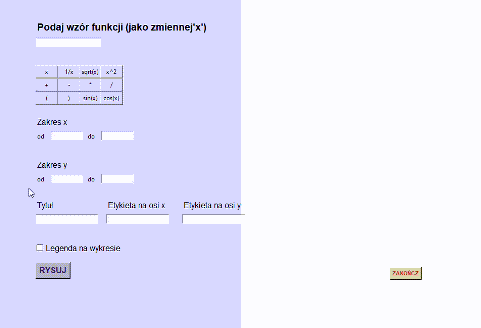

# Rysowanie wykresów funkcji
## Graficzny interfejs generujący wykresy funkcji.
Program rysuje wykres na podstawie wzoru oraz parametrów funkcji podanych przez użytkownika.

## O aplikacji

w polu <b><em>Podaj wzór funkcji</em></b> należy wpisać wzór funkcji.<br>
Jako zmienną podajemy <b><em>x</em></b>. Można również wybrać wzór z kalkulatora znajdującego sie pod tym polem.<br>
W polu <b><em>Zakres x</em></b> należy podać zakres na osi poziomej.<br>
W polu <b><em>Zakres y</em></b> należy podać zakres na osi pionowej.<br>
W polu <b><em>Tytuł</em></b> można wpisać tytuł, który wyświetli się na wykresie.<br>
W polu <b><em>Etykieta na osi x</em></b> można wpisać nazwę osi poziomej.<br>
W polu <b><em>Etykieta na osi y</em></b> można wpisać nazwę osi pionowej.<br>
Można również zaznaczyć opcję legendy na wykresie.<br>
Po naciśnięciu przycisku <b><em>Rysuj</em></b> generuje się wykres podanej funkcji wraz z podanymi parametrami.<br>
Przycisk <b><em>Zakończ</em></b> zamyka program.<br>

## Instalowanie

Do uruchomienia aplikacji potrzebne jest zainstalowanie następujących pythonowych bibliotek:

- tkinter,
- matplotlib,
- numpy,
  
aby to zrobić należy wpisać w wierszu poleceń następujące polecenia:

```shell
pip install tkinter
```
```shell
pip install matplotlib
```
```shell
pip install numpy
```

Należy również zainstalować moduł potrzebny do stworzenia pliku wykonalnego aplikacji:

```shell
pip install pyinstaller
```
Z projektu należy pobrać plik <b><em>application.py</em></b>.
Należy pamiętać o tym, aby następne kroki wykonać z poziomu folderu, w którym znajduje się pobrany plik.<br>
W celu zbudowania wykonalnego pliku należy wpisać w wierszu poleceń:

```shell
pyinstaller application.py
```
oraz 

```shell
pyinstaller --onefile --windowed application.py
```
Po wpisaniu tych poleceń wygeneruje się folder <b><em>dist</em></b>, w którym znajduje się plik z rozszerzeniem <b><em>.exe</em></b> ze zbudowaną aplikacją.

## Demo aplikacji




